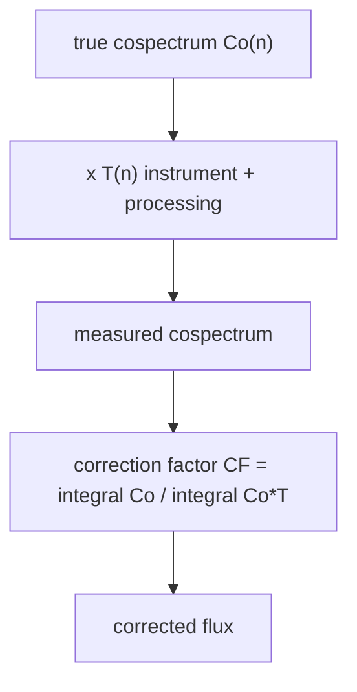

# Spectral corrections

Every eddy covariance system underestimates flux. High frequencies are lost to
finite sensor response, path averaging and sensor separation; low frequencies
are lost to block averaging and detrending. Corrections estimate what was lost
and scale the flux back up.



## Applying them

```python
import TaylorSwift as tswift

instrument = tswift.InstrumentConfig()  # alias of SiteConfig

results = tswift.apply_spectral_corrections(
    results,
    config,           # site_config
    instrument,
    apply_high_freq=True,
    apply_low_freq=True,
    apply_wpl=False,
    method="massman",
    verbose=False,
)
```

| Argument | Default | Effect |
| --- | --- | --- |
| `apply_high_freq` | `True` | Sensor response, path averaging, sensor separation |
| `apply_low_freq` | `True` | Block averaging only |
| `apply_wpl` | `True` | Webb-Pearman-Leuning density correction |
| `method` | `"massman"` | `"massman"` (numerical) or the Horst closed form |
| `verbose` | `False` | Report per-interval correction factors |

!!! warning "`apply_wpl` defaults to `True`"
    WPL needs `co2_mean`, `h2o_mean`, and `P_mean` on each result, and those
    are **not** populated by `process_file`. Either call
    `enrich_results_with_means` first, or pass `apply_wpl=False`.

    ```python
    results = tswift.enrich_results_with_means(results, df, config)
    results = tswift.apply_spectral_corrections(results, config, instrument, apply_wpl=True)
    ```

## High-frequency losses

| Transfer function | Effect it models | Reference |
| --- | --- | --- |
| `tf_first_order_response` | Finite sensor time constant $\tau$ | Moore (1986) |
| `tf_sonic_line_averaging` | Averaging along the sonic path | Kaimal et al. (1968) |
| `tf_scalar_path_averaging` | Averaging along the IRGA optical path | Moore (1986) |
| `tf_sensor_separation` | Physical offset between sonic and IRGA | Moore (1986) |

Sensor separation is usually the largest term for a non-integrated system. For
an IRGASON all three separations are zero and this term vanishes — which is
exactly why the defaults in [`SiteConfig`](configuration.md) matter.

## Low-frequency losses

| Transfer function | Effect it models |
| --- | --- |
| `tf_block_average` | Finite averaging period removes the lowest frequencies |
| `tf_linear_detrend` | Detrending removes more of them |

`tf_linear_detrend` is a standalone helper and is **not** part of the combined response. Whether it should replace or accompany block averaging has not been validated here; no detrending response has been added. The combined low-frequency response depends only on `averaging_period`. A 30-minute window loses more
low-frequency flux than a 60-minute one; the ogive tells you whether that
matters at your site (see [Spectra and cospectra](spectra.md)).

## The two methods

=== "Massman (numerical)"

    `compute_spectral_correction_factor` integrates the Kaimal model
    cospectrum against the combined transfer function:

    $$CF = \frac{\int Co_{\text{model}}(n)\, dn}{\int Co_{\text{model}}(n) \, T(n)\, dn}$$

    Accurate, and the default.

=== "Horst (analytical)"

    `horst_analytical_correction` is a closed-form approximation for
    first-order-response scalar sensors (Horst 1997). Cheaper, and useful as a
    sanity check on the numerical result. When low-frequency correction is enabled, the analytical high-frequency factor is multiplied by the numerical block-only factor. This is a separable approximation, not the joint Massman integral.

## Inspecting the transfer functions

They are public, so you can plot the loss spectrum for your own setup:

```python
import numpy as np
import matplotlib.pyplot as plt
from TaylorSwift.transfer_functions import (
    tf_block_average, tf_first_order_response, tf_sonic_line_averaging,
)

freq = np.logspace(-4, 1, 500)

plt.semilogx(freq, tf_block_average(freq, 30.0), label="block average (30 min)")
plt.semilogx(freq, tf_first_order_response(freq, 0.1), label=r"first order ($\tau$=0.1 s)")
plt.semilogx(freq, tf_sonic_line_averaging(freq, 5.0, 0.1), label="sonic line averaging")
plt.xlabel("n [Hz]"); plt.ylabel("T(n)"); plt.legend()
```

Note the argument order: the path-averaging and separation functions take
`(freq, u_mean, length)` — mean wind speed before the geometry, because the
relevant quantity is the eddy transit time $L/\overline{U}$.

`combined_transfer_function` multiplies the relevant ones for a given flux
type:

```python
from TaylorSwift.transfer_functions import combined_transfer_function

T = combined_transfer_function(
    freq, u_mean=5.0, instrument=instrument, averaging_period=30.0, flux_type="wT"
)
```

See the [transfer functions API](../api/transfer_functions.md).

## The Kaimal model cospectrum

Corrections integrate against a *model* cospectrum, not your measured one —
the measured one is already attenuated. `kaimal_cospec_model` supplies the
standard curves:

```python
from TaylorSwift.transfer_functions import kaimal_cospec_model

f_nd = np.logspace(-3, 2, 200)
co_model = kaimal_cospec_model(f_nd, flux_type="wT")
```

Valid `flux_type` values are `"wT"`, `"wu"`, `"wCO2"`, and `"wH2O"`.

## WPL density correction

Open-path analysers measure *density*, which changes with temperature and
water vapour even when the mixing ratio does not. Webb-Pearman-Leuning (1980)
removes that artefact.

```python
from TaylorSwift.corrections import wpl_correction

fluxes = wpl_correction(
    Fc_raw=cov_wCO2,
    Fe_raw=cov_wH2O,
    H=H,
    T_mean=T_mean,
    P_mean=P_mean,
    co2_mean=co2_mean,
    h2o_mean=h2o_mean,
)
```

!!! note "Open path only"
    For an enclosed or closed-path analyser where the sample is brought to
    a controlled temperature, WPL is much smaller or absent. Set
    `irga_type="enclosed_path"` on your `SiteConfig` and consider
    `apply_wpl=False`.

The correction is large for CO₂ — often comparable to the raw flux itself over
a low-flux surface — so getting `P_mean` and the mean densities right is not
optional.

## Sonic transducer shadowing

For a CSAT3, `shadow_correction` implements Horst, Wilczak & Cook (2015). This
is applied by the legacy [pipelines](pipelines.md) rather than the spectral
stack.

## What lands on the result

After `apply_spectral_corrections`, the correction factors are recorded in
`qc_flags` and carried into the exported table, so a reviewer can see how much
of your reported flux is correction:

```python
table = tswift.results_to_dataframe(results)
print([c for c in table.columns if "cf" in c.lower() or "corr" in c.lower()])
```

A correction factor much above ~1.3 is worth investigating — it usually points
at sensor separation or an over-long time constant rather than at genuine
atmospheric conditions.

### Raw fields and the two corrected estimates

Corrections rebuild their outputs from raw data on every call. The original
`cosp_*`, `ncosp_*`, `ogive_*`, `cov_*`, `H`, and stability fields remain raw.
Existing spectrum exports and plots therefore continue to show raw data.
Changing correction options or disabling WPL removes previous correction outputs.
Method names are validated even when the results list is empty.

| Output | Meaning |
| --- | --- |
| `qc_flags['cf_wT']` (and other fluxes) | Model-based multiplicative factor |
| `qc_flags['cov_wT_corrected']` | Raw full-record covariance times model factor |
| `qc_flags['H_corrected']` | Model-corrected temperature covariance times 1200 |
| `result.corrected_spectra['cosp_wT']` | Raw binned area-preserving cospectrum divided by selected transfer response |
| `qc_flags['cov_wT_deconvolved']` | Trapezoidal integral of that array over log frequency |
| `result.corrected_spectra['ogive_wT']` | Reverse cumulative integral, zero at highest bin centre |
| `result.corrected_spectra['ncosp_wT']` | Deconvolved array divided by its own integral |
| `qc_flags['H_deconvolved']` | Deconvolved temperature covariance times 1200 |

The same array keys and covariance conventions apply to `wu`, `wCO2`, and
`wH2O`. A zero or unavailable normalization denominator produces NaNs. Empty
arrays produce no corrected array entries and a NaN deconvolved covariance;
a single bin has no integrable bandwidth and also yields a NaN covariance.

Both switches independently control factors **and** array responses. With both
off, factors are exactly one and corrected cospectra are copies of raw arrays.
With only low frequencies enabled, only block averaging is included. With only
high frequencies enabled, block averaging is excluded. Horst approximates the
high-frequency factor with the existing effective sensor/path time constant;
it does not model all instrument geometry as fully as Massman does.
Frequency-wise array deconvolution is identical for the two method choices.

The scalar model estimate and the integral of a deconvolved measured spectrum
are different estimators. The latter covers only the available bin centres,
uses binned quadrature and can amplify noise. It need not equal the model-scaled
full-record covariance, even when all correction switches are off. Transfer
responses retain the existing clipping to `[1e-10, 1]`; deconvolution near the
floor can be very large. Raw ogives were computed before binning and are not
expected to match the new binned quadrature exactly.

WPL uses the **model-corrected** scalar covariances and `H_corrected`, and writes
only `wpl_Fc`, `wpl_Fe` and their additive corrections in `qc_flags`. It does not
alter cospectra or their normalization. Both heat estimates retain the spectral
stack's fixed volumetric heat capacity of 1200 J m⁻³ K⁻¹.

`qc_flags` records `spectral_method`, `spectral_low_freq`, `spectral_high_freq`,
`spectral_low_response`, and `spectral_status` (`applied`, `disabled`, or
`skipped_invalid_wind`). Enabled spectral corrections require finite wind
speed of at least 0.5 m/s; skipped factors and model estimates are NaN.

`wpl_status` is `applied`, `disabled`, `not_applicable`, `missing_prerequisites`,
or `invalid_prerequisites`. `wpl_missing_prerequisites` lists missing means or
model-corrected inputs. `wpl_pressure_source` is `measured`,
`standard_atmosphere_fallback`, or `not_used`; `wpl_pressure_kpa` records the
pressure actually selected. Missing pressure uses 101.3 kPa, while physically
invalid pressure, temperature or density inputs skip WPL visibly.
