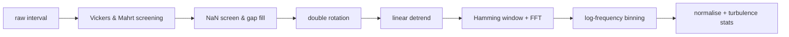

# Spectra and cospectra

`process_file` and `process_interval` are the core of the library. This page
covers what they compute and how to read the output.

## The pipeline per interval



### 1. Screening

[Vickers & Mahrt (1997)](screening.md) tests run on the raw signals and record
`vm97_*` flags. Diagnostic only.

### 2. NaN screen and gap fill

Intervals with more than **5 % NaN in the wind components** short-circuit:
`qc_flags["too_many_nans"] = True` and the spectra come back empty. Below that
threshold, short gaps are linearly interpolated.

```python
usable = [r for r in results if not r.qc_flags.get("too_many_nans")]
```

### 3. Double rotation

The coordinate frame is rotated so that mean $v = 0$ and mean $w = 0$, aligning
the *x*-axis with the mean wind. This is the classical Tanner & Thurtell
approach and is what makes $\overline{w'u'}$ the streamwise momentum flux.

`rotate_wind` is public if you want the rotated components directly — see
[rotations](../api/rotations.md).

### 4. Linear detrend

Each window is linearly detrended (NaN-safe). Detrending removes the lowest
frequencies, which is itself a flux loss — corrected later by
`tf_linear_detrend`. See [Spectral corrections](corrections.md).

### 5. FFT

A Hamming window is applied and the cross-spectral density computed by FFT.

### 6. Logarithmic binning

Raw FFT output is far too noisy to plot. Estimates are block-averaged into
logarithmically spaced bins — the community standard since Kaimal et al.
(1972). Control the resolution with `bins_per_decade` (default 20):

```python
results = tswift.process_file(df, config, bins_per_decade=12)  # smoother
```

More bins means more detail and more noise. Twenty is a good default; drop to
10–12 for noisy or short records.

### 7. Normalisation

Output is in **area-preserving** form, so equal areas under the curve on a
log-frequency axis represent equal contributions to the flux:

| Field | Quantity |
| --- | --- |
| `cosp_wT` | $n \cdot Co_{wT}(n)$ |
| `ncosp_wT` | $n \cdot Co_{wT}(n) / \overline{w'T'}$ |
| `spec_w` | $n \cdot S_w(n) / \sigma_w^2$ |

The normalised forms are what you compare against the Kaimal curves; the
unnormalised cospectra are what integrate back to the flux.

## Frequency axes

Two are provided:

| Field | Meaning |
| --- | --- |
| `freq` | Natural frequency $n$ [Hz] |
| `freq_nd` | Dimensionless frequency $f = n z_{\text{eff}} / \overline{U}$ |

`freq_nd` is the axis for Kaimal-style similarity plots. It depends on
`z_eff = z_measurement - d`, so an incorrect canopy height shifts every curve
horizontally. See [Configuration](configuration.md).

## Ogives

The ogive is the cumulative cospectrum, integrated from high to low frequency:

$$\mathrm{Og}(n_0) = \int_{n_0}^{\infty} Co(n)\, dn$$

It should flatten out at low frequency. If it is still climbing at the lowest
resolved frequency, your averaging period is too short to capture the whole
flux — the classic diagnostic for choosing between 30 and 60 minutes.

```python
from TaylorSwift.plotting import plot_ogive
fig = plot_ogive(results)
```

## Turbulence statistics

Each `SpectralResult` carries the derived scalars:

| Field | Quantity | Units |
| --- | --- | --- |
| `u_mean` | Mean streamwise wind | m s⁻¹ |
| `wind_dir` | Direction relative to the sonic *x*-axis | ° |
| `T_mean` | Mean sonic temperature | °C |
| `ustar` | Friction velocity $u_*$ | m s⁻¹ |
| `L` | Monin-Obukhov length | m |
| `zL` | Stability parameter $z/L$ | — |
| `H` | Sensible heat flux | W m⁻² |
| `cov_wT`, `cov_wu`, `cov_wCO2`, `cov_wH2O` | Raw covariances | — |

$z/L$ is the stability coordinate: negative is unstable (convective), near zero
is neutral, positive is stable.

## Working with a single interval

```python
import numpy as np
import TaylorSwift as tswift

result = tswift.process_interval(
    u_raw=u, v_raw=v, w_raw=w,
    T_sonic=T, co2=co2, h2o=h2o,
    config=config,
    timestamp_start=t0,
    timestamp_end=t1,
)
```

`timestamp_start` / `timestamp_end` are optional but propagate into the
exported tables, so pass them if you have them.

## Low-level access

If you want the transform without the pipeline:

```python
from TaylorSwift.cospectra import compute_cospectrum, compute_spectrum, log_bin

freq, cosp = compute_cospectrum(w, T, fs=20.0)
freq_b, cosp_b = log_bin(freq, cosp, bins_per_decade=20)
```

These operate on already-rotated, already-detrended arrays — they do no
preprocessing. See the [cospectra API](../api/cospectra.md).

## Next

- [Spectral corrections](corrections.md) — recovering the attenuated flux
- [Quality control](quality-control.md) — deciding which intervals to keep
- [Exporting results](results.md) — getting to a table
