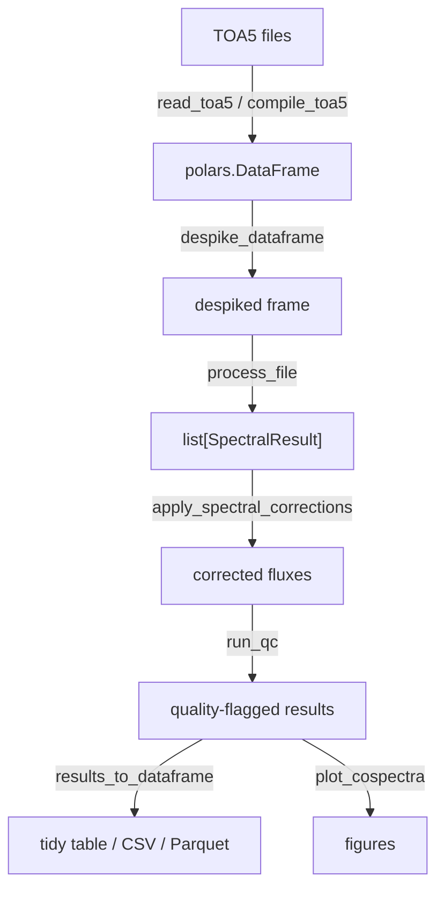
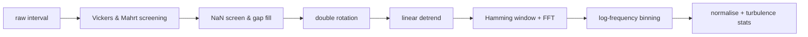

# TaylorSwift

[](https://pypi.org/project/taylorswift-spectra/)
[](https://pypi.org/project/taylorswift-spectra/)
[](https://github.com/inkenbrandt/TaylorSwift/blob/main/LICENSE)

FFT-based (co)spectral analysis for eddy covariance time series. The name
honours the physicist Sir Geoffrey Ingram Taylor, not the musician.

`TaylorSwift` implements the standard micrometeorological workflow for
computing power spectra and cospectra from high-frequency sonic anemometer and
open-path gas analyser data, following Kaimal et al. (1972) conventions.

<div class="grid cards" markdown>

-   :material-download: **[Installation](installation.md)**

    Install from PyPI, or set up a development checkout.

-   :material-rocket-launch: **[Quickstart](quickstart.md)**

    From a TOA5 file to corrected, quality-flagged cospectra in eight steps.

-   :material-book-open-variant: **[User Guide](guide/configuration.md)**

    One page per stage of the pipeline, with the physics behind each.

-   :material-api: **[API Reference](api/index.md)**

    Every public function and dataclass, generated from the source.

</div>

## Features

- **Spectral computation** — double-rotation, linear detrending,
  Hamming-windowed FFT, logarithmic frequency binning, area-preserving
  normalization
- **Spectral corrections** — block-average, linear-detrend, first-order sensor
  response, sonic path averaging, sensor separation (Massman 2000; Horst 1997)
- **Raw-data screening** — Vickers & Mahrt (1997) spike, amplitude-resolution,
  dropout, absolute-limit and higher-moment tests
- **Despiking** — iterative UKDE despiking for raw time series
  (Metzger et al. 2012); rolling IQR, median-RLM, and EWMA methods via
  `CalcFlux`
- **WPL density correction** — Webb-Pearman-Leuning (1980) for open-path
  CO₂/H₂O fluxes
- **Quality control** — inertial-subrange slope fitting, stationarity test
  (Foken & Wichura 1996), Foken 9-class quality flags, ITC tests, outlier
  detection
- **Physical constants** — curated constants, surface-type enumerations, and
  roughness / displacement height helpers
- **Flux pipeline** — end-to-end `CalcFlux` processor for IRGASON and KH-20
  sensor suites with Polars/pandas compatibility
- **I/O** — fast Campbell Scientific TOA5 reader and multi-file compiler
  (Polars backend)
- **Plotting** — publication-quality Kaimal-style spectral and cospectral
  figures

## Processing pipeline



Inside `process_file`, each averaging interval passes through:



## A 20-line example

```python
import numpy as np
import TaylorSwift as tswift

config = tswift.SiteConfig(
    z_measurement=3.0,
    z_canopy=0.3,
    sampling_freq=20.0,
    averaging_period=30.0,
)

rng = np.random.default_rng(0)
n = int(30 * 60 * 20)  # 30 minutes at 20 Hz

result = tswift.process_interval(
    u_raw=5.0 + rng.normal(0, 0.5, n),
    v_raw=rng.normal(0, 0.3, n),
    w_raw=rng.normal(0, 0.15, n),
    T_sonic=20.0 + rng.normal(0, 0.5, n),
    co2=700.0 + rng.normal(0, 5.0, n),
    h2o=10.0 + rng.normal(0, 0.5, n),
    config=config,
)

print(f"u*  = {result.ustar:.3f} m/s")
print(f"H   = {result.H:.1f} W/m²")
print(f"z/L = {result.zL:.3f}")
```

## Citation

If you use `TaylorSwift` in published work, please cite the underlying methods
(see [References](references.md)) alongside the software.

## References

The full, per-method bibliography lives on the
[References](references.md) page.
